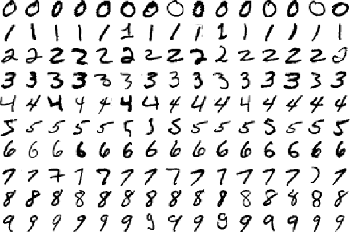

# ensemble methods for classifying images of digits

In this project we will attempt to classify handwritten digits using three different approaches based on Decision Trees. 

### dataset

The dataset we will be using for this project contains normalized handwritten digits, automatically scanned from envelopes by the U.S. Postal Service. The original scanned digits are binary and of different sizes and orientations; the images have been deslanted and size normalized, resulting in 16 x 16 grayscale images.



### decision trees 

We will use decision trees as the basic building block for the three approaches. 

Here we create a simple decision tree:

```
library(rpart)
tree <- rpart(as.factor(V1) ~ ., data = x.train, method='class')
plot(tree, uniform=FALSE, margin=0.1)
text(tree,use.n=F)
```


As you can see, each node in the decision tree will be looking at the grayscale value of certain pixel in the 16x16 image and make a decision based on a threshold. The results of a series of these decisions will determine what digit the tree will classify the image as.

We can see how well this tree does on new data by computing the prediction accuracy on the test data:

```
tree.pr <- predict(tree, newdata=x.test, type='class')
tree.pr.acc <- 1- sum(as.numeric(as.numeric(levels(tree.pr))[tree.pr]- as.numeric(x.test$V1) != 0))/dim(x.test)[1]
tree.pr.acc
```

which ends up being **0.7249626**. Meh.

## bagging decision trees

Have a look at this fine specimen:


Not exactly clear what it represents, right? 

If our life depended on it we could survey 20 people and look at what they think and make a decision based on that. Chances are we'd likely get a few people saying "1", maybe a few saying "8" but most will probably say it's a "5". We would arrive at our decision by taking the majority vote of the responses. 

This is the idea behind bagging decision trees. We will use a number of decision trees, each with different decision making reasonings, and take a majority vote of their responses to arrive at a final prediction. 

However, we can't just build the 20 decision trees using the same method as we used for building the single tree above. We need to train each tree on **different samples** of the training set or else we would just end up with 20 identical decision trees. This is analogous to asking the same person what digit they think an image is; they will answer the same every time and our predictor would not be any more robust. 

When we randomly sample from the training set to create these "new" training sets, we call them **bootstrap samples**.

Here we build 20 decision trees, each on a different bootstrap samples of the training set:

```
my.c <- rpart.control(minsplit = 3, cp = 1e-6, xval = 10)
NB <- 20
ts <- vector('list',NB)
n <- nrow(x.train)
for (j in 1:NB){
  ii <- sample(1:n, replace=TRUE)
  ts[[j]] <- rpart(V1 ~ ., data = x.train[ii,], method = 'class', parms = list(split = 'information'), control= my.c)
}
```

We get some trees:


Notice how each tree is fairly deep. These trees are overfit and will likely perform a lot worse than the tree we built above. We actually want these trees to be overfit because when we aggregate their predictions, they aggregated predictor will be more robust. This follows similar reasoning as to why we wouldn't want to ask the same person what digit they think it is 20 times. 

Now for each image, we will compute a majority vote:

```
prs <- list()
for(j in 1:NB) {
  pr <- predict(ts[[j]], newdata=x.test, type='class')
  prs[[j]] <- as.matrix(pr)
}
prs.mx = do.call(cbind, prs)
prs.bagg <- c()
for (i in 1:dim(prs.mx)[1]){
  prs.bagg <- c(prs.bagg, mode(prs.mx[i,]))
}
```

and compute the prediction accuracy:

```
bagg.pr.acc <- 1- sum(as.numeric(as.numeric(prs.bagg) - as.numeric(x.test$V1) != 0))/dim(x.test)[1]
```

which comes out (for this particular run) to be **0.8844046**. Better!


## random forests

Random Forest is an extension over bagging. It takes one extra step where in addition to taking bootstrap samples, it also takes a random selection of *features* rather than using all features to grow trees.

Remember that our features are grayscale values of pixels. So in our Random Forest, we will have trees that ignore some pixels completely.

Lets build a random forest!

```
library(randomForest)
y.tr <- as.factor(x.train$V1)
rf <- randomForest(as.factor(V1) ~ ., data = x.train, ntree = 50)
```

that was easy. Now lets make some predictions:

```
rf.pr <- predict(rf, newdata=x.test, type='class')
rf.pr.acc <- 1-sum(as.numeric(as.numeric(levels(rf.pr))[rf.pr] - as.numeric(x.test$V1) != 0))/dim(x.test)[1]
```

The prediction accuracy (for this particular run) turns out to be **0.9407075**. Nice one, Random Forests!

##Authors

Evan James Martin


